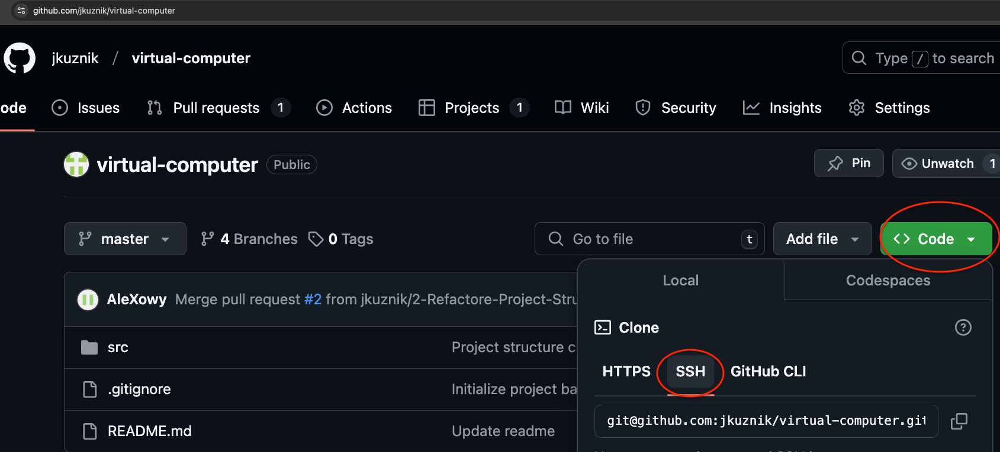

## 1. Klonowanie zdalnego repozytorium

1.1 Aby sklonować repozytorium, z linku https://github.com/jkuznik/virtual-computer wybierz "Code" następnie SSH i skopiuj link:
```bash
git@github.com:jkuznik/virtual-computerApp.git
```


1.2 W Intellij wybierz:
- **New > Project from Version Control**
- W polu URL wklej skopiowany wcześniej w podpunkcie 1.1 link.

---

## 2. Tworzenie nowego brancha

Według przyjętej konwencji tworzymy nowy branch o nazwie takiej samej jak wykonywany task.

Za pomoną terminala wbudowanego w Intellij (Alt+F12) utwórz nowy branch używając komendy:
```bash
git switch -c nazwa_taska
```

---

## 3. Dodawanie zmian i wypychanie ich do repozytorium

Po wprowadzeniu zmian użyj komendy:
```bash
git commit -am "Opis wprowadzonych zmian"
```

### Wypchnij zmiany na zdalne repozytorium

3.1 Przed pierwszym wypchnięciem zmian na zdalne repozytorium, użyj komendy:
```bash
git push --set-upstream origin nazwa_brancha
```

3.2 Przy każdym następnym wypchnięciu zmian, użyj komendy:
```bash
git push
```
