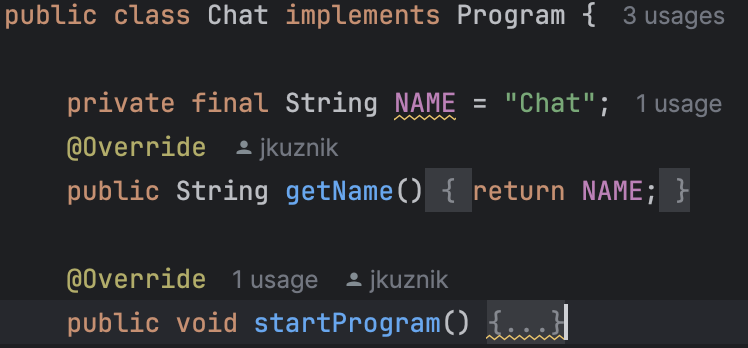

# Implementation of Interfaces
To add a custom CLI-style program to the application, you need to implement one of the two interfaces available in
the project: the Program interface or the Game interface. This guide provides implementation tips for the Program
interface; however, implementing the Game interface follows a similar approach.

<b>These interfaces completely contradict the DRY principle</b> from the way they are implemented to how they are later
used. However, they may enhance code readability for absolute beginners, which is the target audience for this
project.

Create a new package under the path <b>src/software/program/</b> and set up the entire infrastructure required for
your program to function.

Next, in the main class of your program, implement the Program interface. An easy way to do this is by adding a
parameter to specify the name of your program and replacing the declaration of the .main(String[] args) method
with the declaration of the implemented method .startProgram().

From now on, your program will be accessible through the appropriate submenu in the main application.

