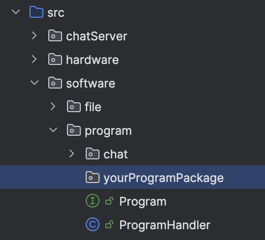

# Implementacja interfejsów

Aby dodać do aplikacji program typu CLI własnego autorstwa należy zaimplementować jeden z <i>dwóch dostępnych* </i>
interfejsów dostępnych w projekcie - interfejs 'Program' lub 'Game'. 

Utwórz nowy pakiet w ścieżce pakietów <b>src/software/program/</b> i utwórz tam całą niezbędną infrastrukturę dla
działania Twojego programu 

Interfejsy te zaprzeczają na każdej
płaszczyźnie zasadzie DRY jednak z 