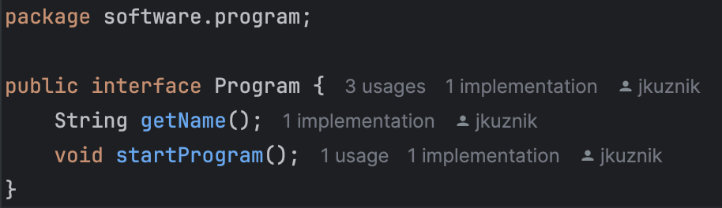
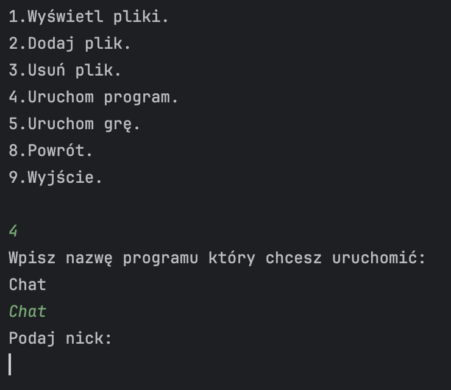

# Implementacja interfejsów

Aby dodać do aplikacji program typu CLI własnego autorstwa należy zaimplementować jeden z dwóch
interfejsów dostępnych w projekcie - interfejs 'Program' lub 'Game'. Poniższa instrukcja zawiera podpowiedzi 
implementacji interfejsu 'Program' jednak implementowanie 'Game' jest analogiczne. <b>Interfejsy te zaprzeczają
na każdej płaszczyźnie zasadzie DRY </b> począwszy od sposobu implementacji, aż do późniejszego korzystania z nich
jednak mogą zwiekszyć czytelność kodu dla osób całkowicie początkujących, a właśnie dla tych osób jest adresowany ten projekt.

Utwórz nowy pakiet w ścieżce pakietów <b>src/software/program/</b> i utwórz tam całą niezbędną infrastrukturę dla
działania Twojego programu 

Następnie w klasie głównej Twojego programu zaimplementuj interfejs 'Program'. Łatwym sposobem na to jest dodanie 
parametru określającego nazwę Twojego programu, a deklarację metody <b>.main(String[] args)</b> zamienić na 
deklarację implementowanej metody <b>.startProgram()

Od teraz program będzie dostępny z odpowiedzniego podmenu w głównej aplikacji

